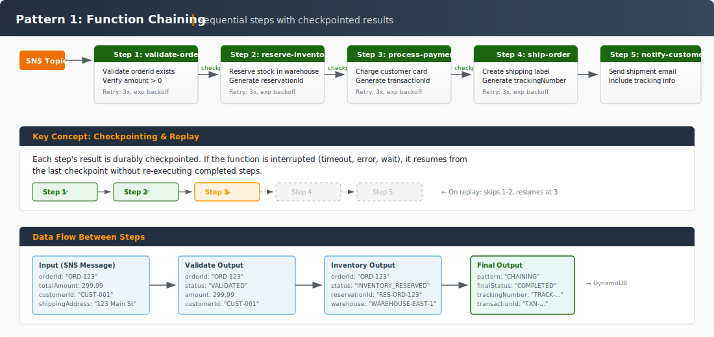
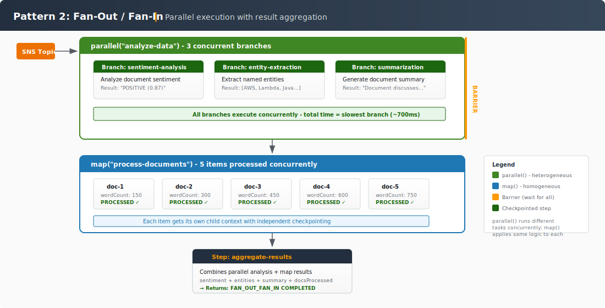
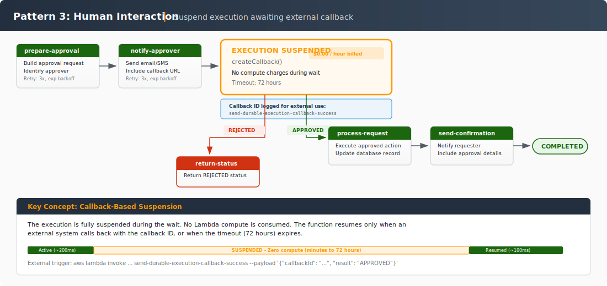
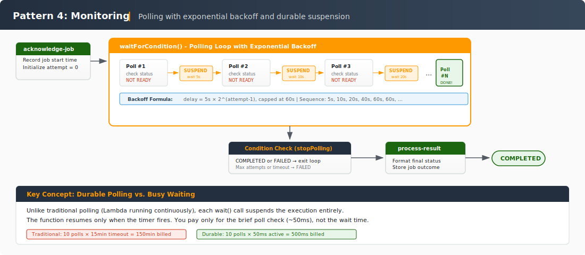
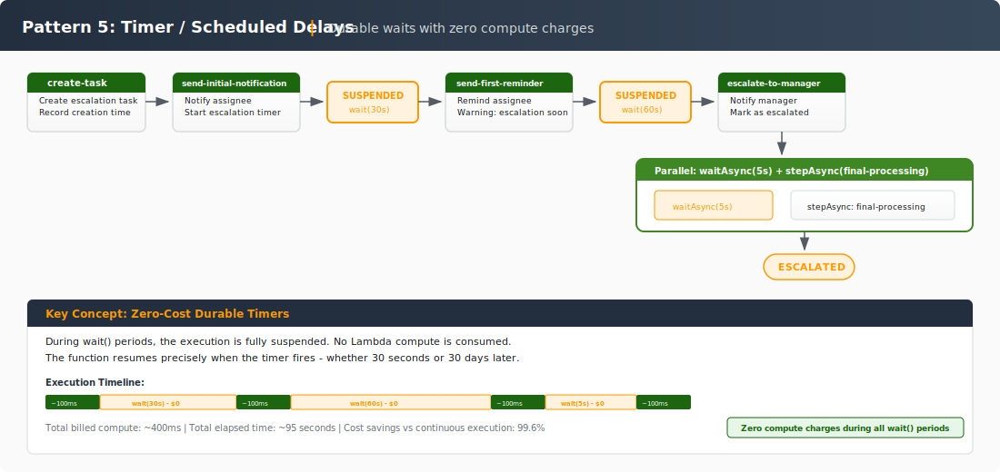
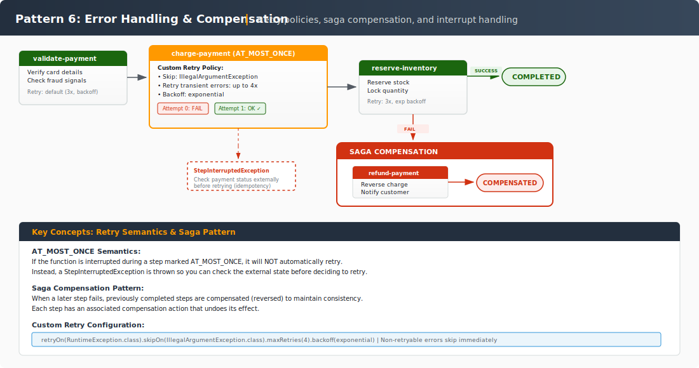
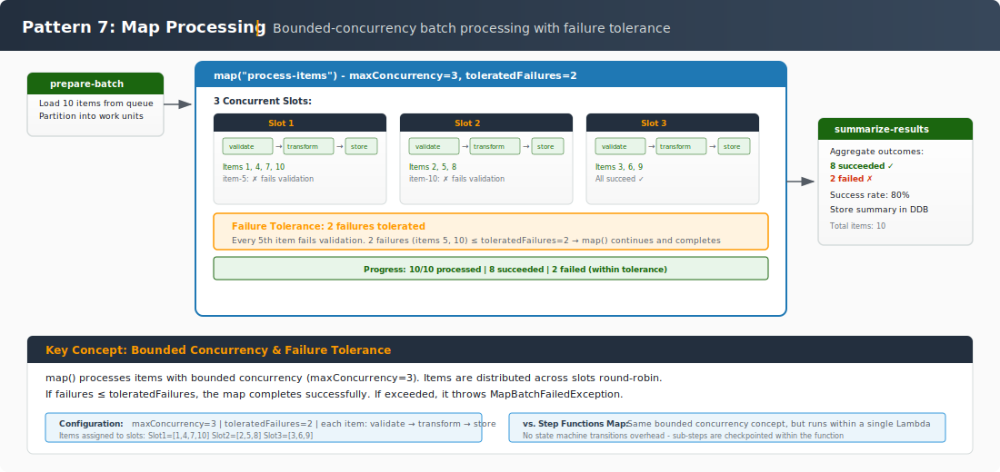
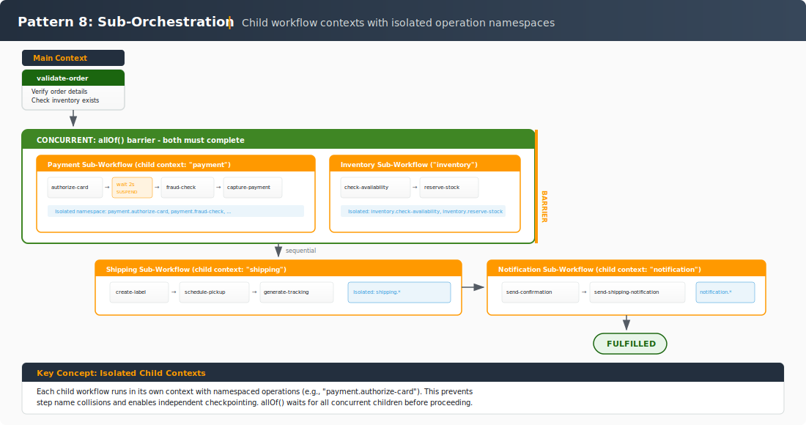

# Lambda Durable Functions - Step Diagrams

Visual step-by-step flow diagrams for each durable execution pattern.

---

## Pattern 1: Function Chaining

Sequential steps where each step's output feeds into the next. Completed steps are checkpointed and never re-executed on replay.

---

## Pattern 2: Fan-Out / Fan-In

Parallel execution of independent operations with result aggregation. Uses `parallel()` for heterogeneous tasks and `map()` for homogeneous collection processing.

---

## Pattern 3: Human Interaction

Execution suspends while waiting for an external human decision via callback. No compute charges during the wait. An external system calls `send-durable-execution-callback-success` or `send-durable-execution-callback-failure` to resume.

---

## Pattern 4: Monitoring / Polling

Uses `waitForCondition` to poll an external system with exponential backoff. The function suspends between polls without consuming compute.

---

## Pattern 5: Timer / Scheduled Delays

Uses `wait()` to suspend execution for specified durations. The function exits and is automatically resumed when the wait completes — zero compute charges during waits.

---

## Pattern 6: Error Handling & Saga Compensation

Demonstrates retries with backoff, at-most-once semantics for non-idempotent operations, custom retry logic, and saga compensation when later steps fail.

---

## Pattern 7: Map Processing

Processes a collection concurrently with configurable concurrency limits and failure tolerance. Each item gets its own child context with independent checkpoints.

---

## Pattern 8: Sub-Orchestration

Uses `runInChildContext()` and `runInChildContextAsync()` to compose complex workflows from isolated, reusable sub-workflows. Each child context has its own operation namespace.

